# Enterprise Agentic Suite 🤖
**The Blueprint for Autonomous Enterprise AI Systems (2026)**

## 🏛️ Executive Summary
This ecosystem represents a production-grade architecture for deploying **Autonomous Agents** in high-compliance environments (Banking, Healthcare, Legal). It solves the "Last Mile" problem of connecting LLMs to legacy data silos safely.

## 🔗 The Trinity Architecture
This suite is composed of three integrated flagship systems:

| System | Role | Tech Stack | Status |
| :--- | :--- | :--- | :--- |
| **[Enterprise Context Mesh](./enterprise-context-mesh)** | **The Body** (Data Layer) | MCP, Python, PostgreSQL | ✅ v1.0 Released |
| **[AI Ops Agent](./ai-ops-agent)** | **The Brain** (Orchestration) | LangGraph, Pydantic AI | ✅ v0.1.0 Released |
| **[Eval Reliability Platform](./eval-platform)** | **The Conscience** (Audit) | Arize Phoenix, PyTest | ✅ v0.1.0 Released |

## 🏗️ High-Level Topology

```mermaid
%%{init: {
  'theme': 'base',
  'themeVariables': {
    'primaryColor': '#01579b',
    'primaryTextColor': '#ffffff',
    'primaryBorderColor': '#81d4fa',
    'lineColor': '#81d4fa',
    'secondaryColor': '#003366',
    'tertiaryColor': '#263238',
    'clusterBkg': '#1a1a1a',
    'clusterBorder': '#81d4fa',
    'edgeLabelBackground':'#1a1a1a',
    'nodeTextColor': '#ffffff'
  }
}}%%
graph TD
    %% Define Nodes
    Client(["👤 Human / Agentic Client"])

    subgraph "Governance (The Brain)"
        Ops["🛡️ AI Ops Agent"]
        Auth{"🔐 Auth & Budget"}
    end

    subgraph "Data (The Body)"
        ECM["🌐 Enterprise Context Mesh"]
        Router["🔀 MCP Router"]
    end

    subgraph "Audit (The Conscience)"
        Eval["⚖️ Eval Platform"]
        Log["📝 Audit Log (SIEM)"]
    end

    subgraph "Legacy Data"
        SQL[("🛢️ SQL / ERP")]
        API["☁️ Salesforce / CRM"]
    end

    %% Optimized Flow
    Client --> Ops
    Ops --> Auth
    
    Auth -->|"Approved"| ECM
    Auth -->|"Denied"| Client

    ECM --> Router
    Router --> SQL
    Router --> API

    SQL --> Router
    API --> Router

    Router --> Eval
    Eval --> Log
    Log -->|"Grounded Response"| Client

    %% Styling
    classDef secure fill:#0d47a1,stroke:#81d4fa,stroke-width:2px,color:#ffffff;
    classDef legacy fill:#e65100,stroke:#ffb74d,stroke-width:2px,color:#ffffff;
    classDef critical fill:#b71c1c,stroke:#ef9a9a,stroke-width:2px,color:#ffffff;

    class Ops,ECM,Eval secure;
    class SQL,API legacy;
    class Auth critical;
```

## 💼 Consulting & Advisory
Designed by **[Shrikant Kashi]**, Principal AI Systems Architect.
*Specializing in $50M+ Enterprise AI Transformations.*

## ⚖️ License & Commercial Use
This architectural blueprint is open-source under the **MIT License**.

**Advisory Services:**
While the code is free, implementing this architecture securely at scale requires enterprise customization.
For **Advisory & Integration Services** (Custom Adapters, SOC2 Compliance, On-Prem Deployment), please contact:
**[www.linkedin.com/in/shrikant-kashi-488448159]**
